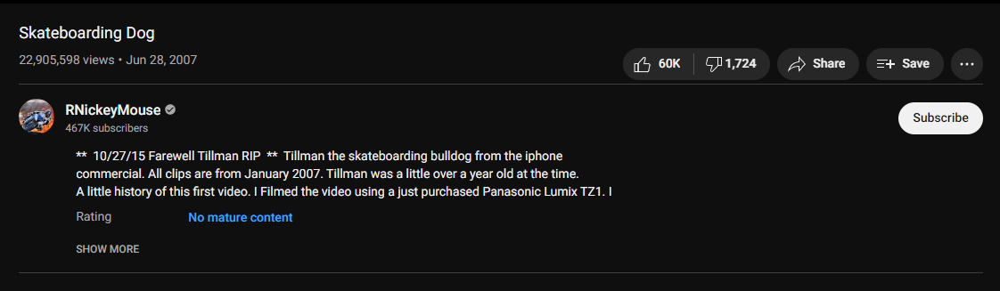
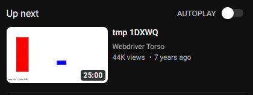

## ⚠ MINIMAL LANGUAGE SUPPORT ⚠
## ⚠ PLEASE SEE [LOCALIZATION.MD](LOCALIZATION.md) ⚠

# Watch9 Reconstruct
Introduced in 2017, Watch9 was the Watch page's layout up until 2019. This userscript aims to restore that layout.

The original script was broken with the new youtube updates but was able to work again with some code rearranging. It will not look like it did with the original script but this is by far in my opinion the definitive watch page layout blending the old with the new. This was a personal project to fix this script, since I was dissatisfied with the new layout shortening the date and views counter, along with the new layout hiding the save button in the hamburger menu pullout button. This modified script restores the functionality that was expected before the new layout change while keeping the rest of the layout untouched like the buttons and ambient mode.

Autoplay layout was tested and fully working.

# Screenshots

# FaQ
**Q: How do I change options?**

A: There's a constant variable at the start of the script which holds the options, change those.

**Q: Why is it called Watch9?**

A: The layout that came before was known internally as Watch8, the one before as Watch7, the one before as Watch6, etc. etc. So it made the most logical sense to call this one Watch9.

# Old versions
You can find old versions on the [Greasy Fork page](https://greasyfork.org/en/scripts/447194-watch9-reconstruct), although it is HIGHLY RECOMMENDED that you DO NOT use these versions as they are riddled with bugs.
